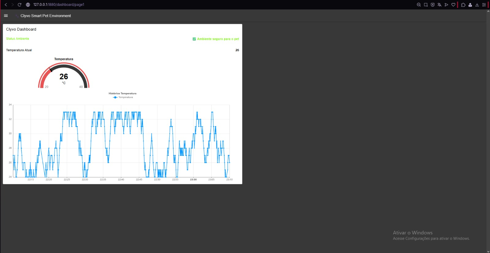
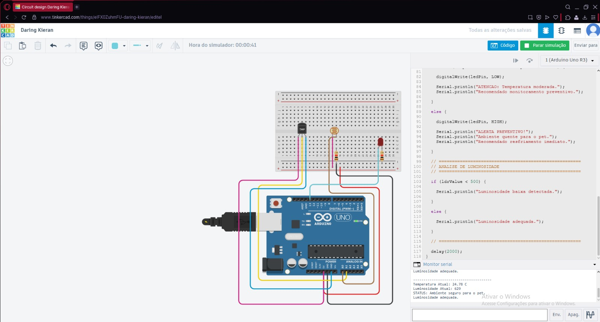
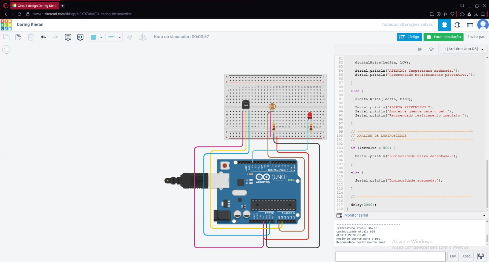

# Clyvo Smart Pet Environment

Sistema IoT preventivo para monitoramento de ambiente pet utilizando Arduino, MQTT e Node-RED.

---

# Sobre o Projeto

O *Clyvo Smart Pet Environment* foi desenvolvido como uma solução IoT voltada ao monitoramento preventivo do ambiente de pets, auxiliando tutores no acompanhamento contínuo das condições ambientais que podem impactar a saúde e o bem-estar animal.

A proposta faz parte da iniciativa Clyvo Care AI, cujo objetivo é facilitar o acompanhamento da saúde e da vida do pet de forma contínua, preventiva e acessível.

O projeto utiliza sensores conectados ao Arduino para coleta de dados ambientais, comunicação MQTT para transmissão das informações e Node-RED para monitoramento em tempo real através de dashboard IoT.

---

# Objetivo

Monitorar condições ambientais básicas utilizando sensores conectados ao Arduino, gerando alertas preventivos para auxiliar no cuidado diário do pet.

---

# Funcionalidades

✅ Monitoramento de temperatura ambiente  
✅ Monitoramento de luminosidade  
✅ Alertas preventivos automáticos  
✅ Acionamento de LED em situação de risco  
✅ Comunicação MQTT em tempo real  
✅ Dashboard IoT utilizando Node-RED  
✅ Histórico de temperatura  
✅ Sistema IoT funcional utilizando Arduino  

---

# Tecnologias Utilizadas

- Arduino UNO
- Tinkercad
- Node-RED
- MQTT (HiveMQ Broker)
- Dashboard IoT
- Linguagem C/C++ (Arduino)
- Sensor TMP36
- Sensor LDR
- LED
- Protoboard

---

# Componentes Utilizados

| Componente | Quantidade |
|---|---|
| Arduino UNO | 1 |
| Sensor TMP36 | 1 |
| Sensor LDR | 1 |
| LED | 1 |
| Resistores | 2 |
| Protoboard | 1 |

---

# Arquitetura do Projeto

Sensores → Arduino → MQTT → Node-RED → Dashboard IoT

---

# Comunicação MQTT

O protocolo MQTT foi utilizado para comunicação em tempo real entre o Arduino simulado e o Node-RED.

O broker público HiveMQ foi utilizado para transmissão dos dados de temperatura monitorados pelo sistema.

---

# Funcionamento do Sistema

O sistema realiza leituras contínuas de:

- Temperatura ambiente
- Intensidade luminosa

Com base nos valores coletados:

- O LED é acionado em situações de temperatura elevada;
- Alertas preventivos são exibidos no dashboard;
- O sistema identifica baixa luminosidade no ambiente;
- Os dados são enviados utilizando MQTT;
- O Node-RED realiza o monitoramento em tempo real.

---

# Dashboard IoT

O Node-RED foi utilizado para criação do dashboard IoT responsável pela exibição em tempo real dos dados coletados pelo sistema.

O dashboard apresenta:

- Temperatura atual
- Indicadores visuais
- Alertas preventivos
- Histórico de temperatura
- Monitoramento em tempo real

---

# Evidências do Projeto

## Dashboard IoT



---

## Ambiente Seguro



---

## Alerta de Temperatura



---

## Baixa Luminosidade


---

# Simulação no Tinkercad

Acesse a simulação do projeto:

https://www.tinkercad.com/things/eIFX0ZuhmFU-daring-kieran/editel?returnTo=https%3A%2F%2Fwww.tinkercad.com%2Fdashboard&sharecode=IQPALltH_nCpicNBdRjcay95R04LjODOq32z3L-Rodk

---

# Estrutura do Projeto

```text
/
├── code/
│   └── clyvo_pet_environment.ino
│
├── docs/
│   ├── arquitetura.md
│   └── node-red-flow.json
│
├── images/
│   ├── dashboard.png
│   ├── Ambiente-Seg-Luminosidade-Adequada.jpeg
│   ├── Ambiente-quente.jpeg
│   └── Luminosidade-Baixa.jpeg
│
└── README.md
